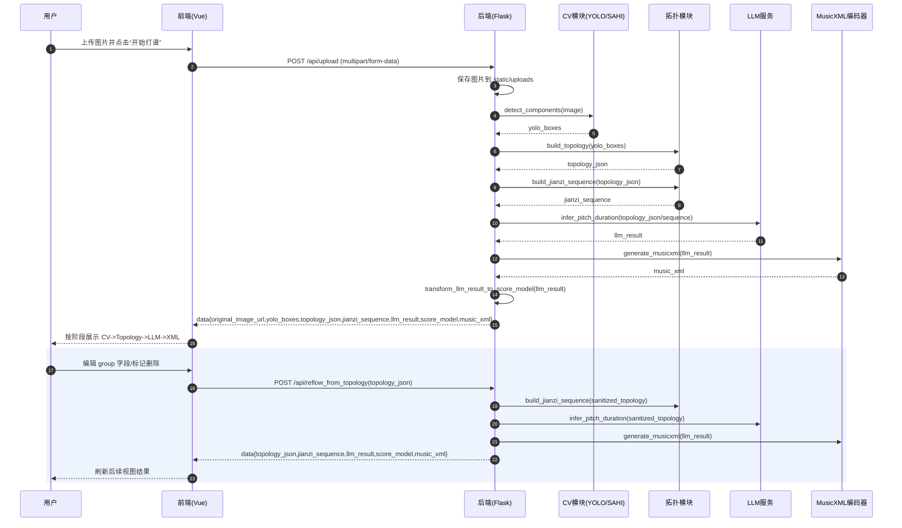

# 核心业务时序图说明与提示词

## 1. 时序图目标

展示用户点击“开始打谱”后，多组件协作的完整通信过程，覆盖：

1. 前端（Vue）
2. 后端 API（Flask）
3. YOLO/拓扑模块
4. LLM 接口
5. MusicXML 编码模块
6. 前端分阶段渲染与交互修正回路

## 2. 主流程说明（可直接写论文）

1. 用户在前端上传图片并点击“开始打谱”。
2. 前端通过 `POST /api/upload` 将图片发送至后端。
3. 后端保存图片后调用 `cv_module.detect_components` 获取检测框。
4. 后端调用 `topology_module.build_topology` 生成 `topology_json`。
5. 后端调用 `topology_module.build_jianzi_sequence` 生成 LLM 输入序列。
6. 后端调用 `llm_module.infer_pitch_duration` 获取打谱结果 `llm_result`。
7. 后端调用 `score_model_transformer` 与 `musicxml_encoder` 输出 `score_model` 和 `music_xml`。
8. 后端一次性返回完整结果包。
9. 前端按阶段更新视图（CV -> Topology -> LLM -> XML）。

## 3. 修正回路说明（论文亮点）

1. 用户在特征提取页修改某个 `group_x` 字段或标记删除。
2. 前端通过 `POST /api/reflow_from_topology` 回传修正后的 `topology_json`。
3. 后端清洗数据并仅重跑后续链路（sequence/LLM/score_model/music_xml）。
4. 前端刷新后续页面结果，无需重新上传和重跑 YOLO。

## 4. 论文级“高质量提示词”（用于生成时序图）

```text
请生成一张用于毕业论文的“古琴减字谱自动打谱系统核心业务时序图”，中文标签，学术规范风格，突出前后端与模型服务协作过程。

参与者（从左到右）：
用户、前端(Vue)、后端API(Flask)、CV模块(YOLO/SAHI)、拓扑模块(Topology)、LLM服务、MusicXML编码器。

主时序步骤必须包含：
1) 用户上传图片并点击开始打谱；
2) 前端 POST /api/upload(图片文件)；
3) 后端保存文件；
4) 后端调用 CV 模块识别检测框；
5) 后端调用拓扑模块生成 topology_json 与 jianzi_sequence；
6) 后端调用 LLM 服务推理 llm_result；
7) 后端调用 MusicXML 编码与渲染模型转换；
8) 后端返回包含 yolo_boxes/topology_json/jianzi_sequence/llm_result/score_model/music_xml 的统一结果；
9) 前端依次更新“特征提取/拓扑序列/乐理推理/打谱渲染”视图。

必须额外绘制“交互修正回路”：
A) 用户在前端编辑 group 字段并标记删除；
B) 前端 POST /api/reflow_from_topology(topology_json)；
C) 后端仅重跑后续链路（sequence->LLM->score_model->music_xml）；
D) 前端刷新后续结果。

图形要求：
- 使用时序图标准箭头（同步调用、返回、注释块）；
- 对关键返回数据用注释框标注；
- 整图横向布局，适合论文单栏或双栏缩放后可读。
```

## 5. Mermaid 时序图初稿



