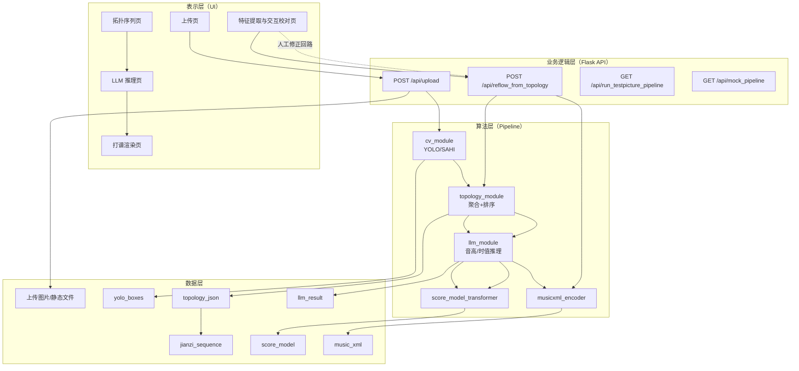

# 系统总体架构图说明与提示词

## 1. 架构目标

绘制一个可用于论文的“四层分层架构图”，清晰表达：

1. 表示层（UI）
2. 业务逻辑层（API 与流程调度）
3. 算法层（YOLO/拓扑/LLM/MusicXML）
4. 数据层（图像文件与结构化结果）

## 2. 分层说明（可直接写论文）

### 2.1 表示层（Presentation Layer）

- 技术：Vue3 + Axios + Tailwind
- 职责：上传图片、展示分阶段结果、进行交互修正、触发重跑与渲染查看
- 关键页面：上传页、特征提取页、拓扑页、LLM 推理页、打谱渲染页

### 2.2 业务逻辑层（Application/API Layer）

- 技术：Flask + CORS
- 核心接口：
  - `POST /api/upload`
  - `POST /api/reflow_from_topology`
  - `GET /api/run_testpicture_pipeline`
  - `GET /api/mock_pipeline`
- 职责：参数校验、流程编排、异常处理、统一响应封装

### 2.3 算法层（Algorithm Layer）

- `cv_module`：YOLO/SAHI 检测与融合
- `topology_module`：框去重、聚类、字段提取、`group_x` 顺序构建
- `llm_module`：提示词构造、上下文推理、结果解析/修复
- `musicxml_encoder`：将音符语义编码为 MusicXML
- `score_model_transformer`：输出前端渲染可用 JSON

### 2.4 数据层（Data Layer）

- 静态文件：上传图片与中间可视化图片（`backend/static/uploads`）
- 结构化数据：`yolo_boxes`、`topology_json`、`jianzi_sequence`、`llm_result`、`score_model`
- 标准交换数据：`music_xml`

## 3. 数据流主线

`原始图片 -> 检测框 -> 拓扑组 -> 减字序列 -> LLM 音符 -> ScoreModel/MusicXML -> 前端渲染`

## 4. 论文级“高质量提示词”（用于生成架构图）

将下面提示词直接给图表生成模型（Mermaid/Draw.io AI/可视化 LLM）：

```text
请生成一张用于毕业论文的“古琴减字谱自动打谱系统总体架构图”，要求中文标签、学术风格、结构清晰、可直接插入论文。

必须采用四层分层架构（自上而下）：
1) 表示层（UI）：Vue3 前端，包含上传页面、特征提取交互校对页面、拓扑序列页面、LLM 推理页面、打谱渲染页面。
2) 业务逻辑层（API/调度）：Flask 服务，核心接口包括 /api/upload、/api/reflow_from_topology、/api/run_testpicture_pipeline、/api/mock_pipeline。
3) 算法层：cv_module（YOLO/SAHI 检测）、topology_module（聚类与group排序）、llm_module（音高时值推理）、score_model_transformer（渲染模型转换）、musicxml_encoder（MusicXML 编码）。
4) 数据层：上传图片存储、yolo_boxes、topology_json、jianzi_sequence、llm_result、score_model、music_xml。

连线要求：
- 用箭头表示主流程方向：图片上传 -> YOLO检测 -> 拓扑聚合 -> LLM推理 -> ScoreModel与MusicXML输出 -> 前端渲染。
- 增加“人工修正回路”：前端交互校对 -> /api/reflow_from_topology -> LLM推理 -> 渲染刷新。
- 在图中用简短文字标注“前后端分离”、“可解释中间结果”、“局部重跑”。

视觉要求：
- 白底或浅底，论文友好配色（蓝/青/灰），避免炫光风格。
- 每层用矩形容器包裹，层标题加粗。
- 导出为 16:9 横版，分辨率不低于 1920x1080。
```

## 5. Mermaid 初稿（可直接粘贴生成）



