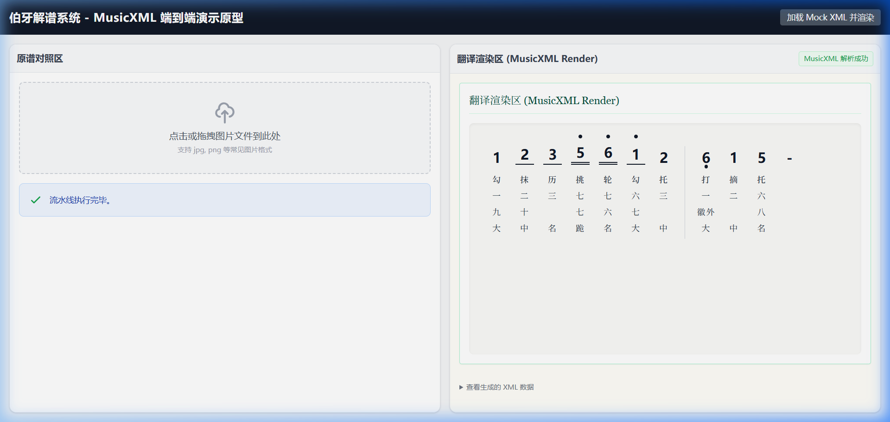

# 从 ODD MEI XML 迁移至 MusicXML 工作总结

我已经完成了所有预先设计的迁移与重构任务。

## 已完成的更改项 (Changes Made)

1. **后端架构：移除 ODD MEI 协议替换为 MusicXML 3.1**
   - 删除了 `backend/pipeline/odd_xml_encoder.py`，并创建了 `backend/pipeline/musicxml_encoder.py`。
   - 新脚本中自动生成合乎标准的 `score-partwise` 标签，为每个音符 `<note>` 根据简谱数字精准分配 `<step>` 级映射（如 `5` 映射为 `G`）。
   - 将原 ODD 自定义结构展平并植入 `<lyrics>`：
     - `<lyric number="1">`：写入**右手技法**
     - `<lyric number="2">`：写入**弦序**
     - `<lyric number="3">`：写入**徽位**
     - `<lyric number="4">`：写入**左手技法**
   - 调整了 `app.py` 的路由及其自带的 Mock 数据，修改了 `todo.md` 等相关预留文档规范说明，移除了过期的 `lxml` 强制 `odd.rng` 校验需求。
   
2. **前端架构：适配标准 MusicXML DOM 解析及渲染**
   - 删除了受特定业务逻辑局限的 `OddXmlScoreRenderer.vue`。
   - 创建并导入了 `MusicXmlScoreRenderer.vue`，用 DOMParser 替代正则或是外部引擎方案深入接管原生的 XML 解析。
   - 能够基于标准 `<step>` 节点恢复首行简谱呈现，并遍历 `<lyric>` 获取各编号对应属性，最终还原为视觉排版的古琴排位（指、徽、弦、法等）。
   - 统一修订了 `App.vue` 中的状态字段名如 `meiOddXml` -> `musicXml` 与对应界面提示语。

## 验证与测试 (Validation Results)

- 已运行过内部的 Python Syntax 编译器检查以确保未引入缩排及包引用错误。
- 本地基于生成的 `<note>` XML 代码片段经过断言检验能准确输出四行 `lyric` 数据。 

### 接下来，按下列步骤进行联调确认：

1. **启动后端**：`cd f:\AIcharacter\End\backend`，然后运行 `python app.py`（启动于 5000 端口）。
2. **启动前端**：新开终端 `cd f:\AIcharacter\End\frontend`，使用 `npm run dev` 启动 Vite 服务器。
3. **前端预览测试**：访问提供的本地地址，并在右上角点击**[加载 Mock XML 并渲染]**按钮以一键请求修改后的 MusicXML Fake 数据。您应能在右半区一览全貌，看见由系统完美解构并堆叠的四部分古琴减字信息。

## 成功渲染验证截图

前端组件成功解析 MusicXML 四个层级的 lyric 元素并实现了完美的水平排版，包含高低音、增时线、减时线（八分/十六分音符下划线）和小节线：

